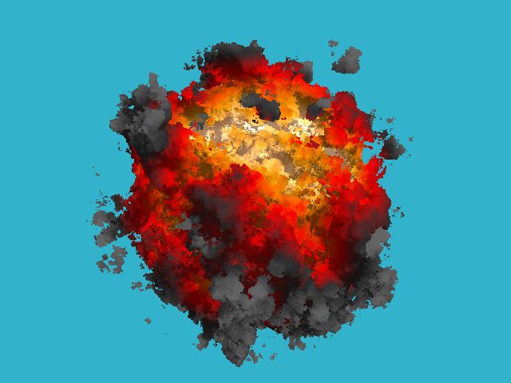
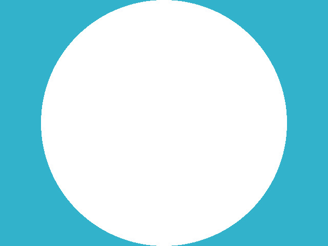
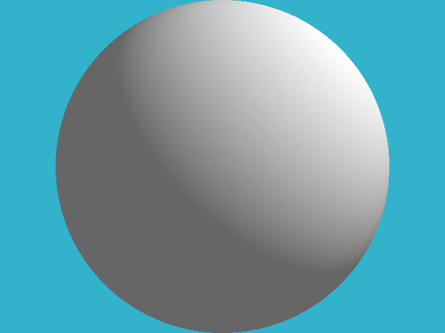
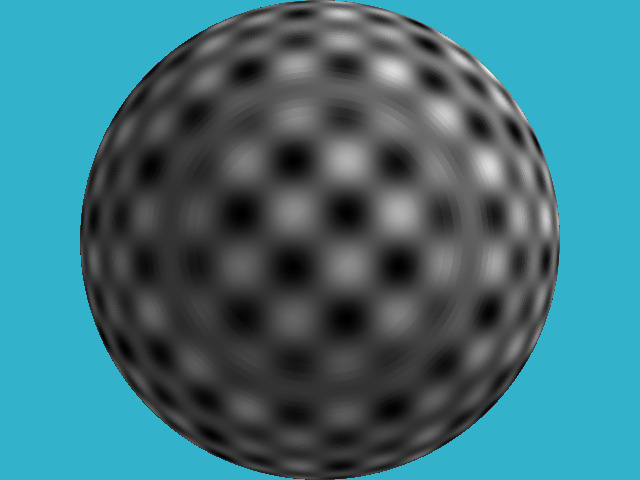
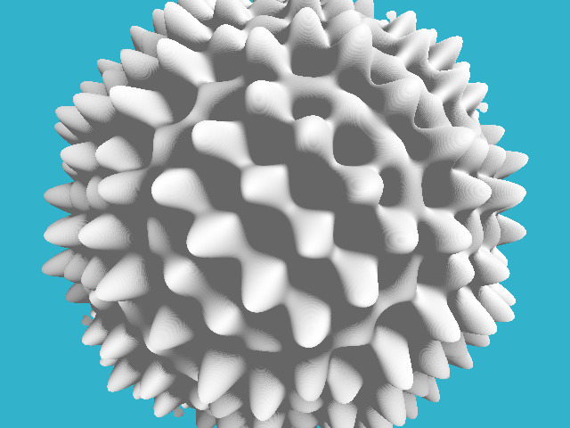
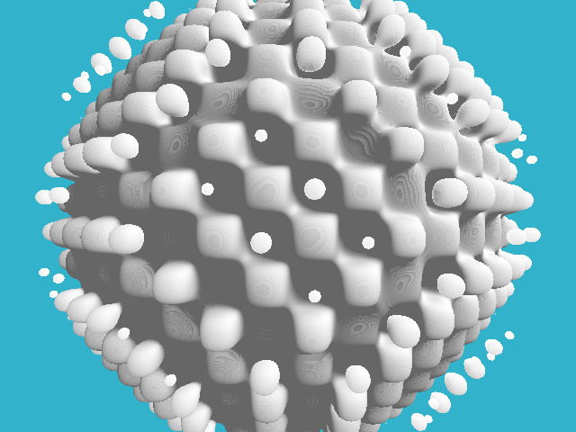
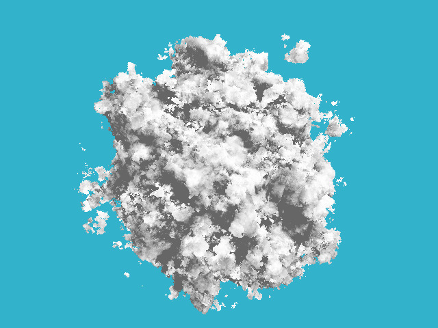

# <center>  KABOOM!

## Step 1: 画一个圆
```
#pragma omp parallel for
    for (size_t j = 0; j<height; j++) { // actual rendering loop
        for (size_t i = 0; i<width; i++) {
            float dir_x =  (i + 0.5) -  width/2.;
            float dir_y = -(j + 0.5) + height/2.;    // this flips the image at the same time
            float dir_z = -height/(2.*tan(fov/2.));
            Vec3f hit;
            if (sphere_trace(Vec3f(0, 0, 3), Vec3f(dir_x, dir_y, dir_z).normalize(), hit)) { // the camera is placed to (0,0,3) and it looks along the -z axis
                framebuffer[i+j*width] = Vec3f(1, 1, 1);
            } else {
                framebuffer[i+j*width] = Vec3f(0.2, 0.7, 0.8); // background color
            }
        }
    }
```

```
float signed_distance(const Vec3f &p) {
    return p.norm() - sphere_radius;
}

bool sphere_trace(const Vec3f &orig, const Vec3f &dir, Vec3f &pos) {
    pos = orig;
    for (size_t i=0; i<128; i++) {
        float d = signed_distance(pos);
        if (d < 0) return true;
        pos = pos + dir*std::max(d*0.1f, .01f);
    }
    return false;
}
```
其中norm返回向量长度，**球心默认在原点处**。
求交方式原始，只是往前一步一步逼近直到在球内。

效果图:


---
## Step 2: diffuse lighting
```
Vec3f light_dir = (Vec3f(10, 10, 10) - hit).normalize();                     // one light is placed to (10,10,10)
                float light_intensity  = std::max(0.4f, light_dir*distance_field_normal(hit));
                framebuffer[i+j*width] = Vec3f(1, 1, 1)*light_intensity;
```

```
Vec3f distance_field_normal(const Vec3f &pos) {
    const float eps = 0.1;
    float d = signed_distance(pos);
    float nx = signed_distance(pos + Vec3f(eps, 0, 0)) - d;
    float ny = signed_distance(pos + Vec3f(0, eps, 0)) - d;
    float nz = signed_distance(pos + Vec3f(0, 0, eps)) - d;
    return Vec3f(nx, ny, nz).normalize();
}
```
### 光照方向 (light_dir)：
1. 光源的位置为 (10, 10, 10)。
2. light_dir 计算的是从命中点 (hit) 到光源的位置向量，并将其归一化。

### 光强度 (light_intensity)：
1. 使用点积计算光照方向与物体表面法线之间的角度。
2. light_dir * distance_field_normal(hit) 计算的是光线方向与表面法线的点积，这个值代表光线与法线之间的夹角对光照强度的影响。
**PS: 挺近似的，都没有精确计算**
3. std::max(0.4f, ...) 保证最低光强度为 0.4，即使点积为负值也不会完全黑暗。
### 像素颜色 (framebuffer)：
1. 乘以光强度 light_intensity 来调节命中点的亮度。
2. 设置该像素的颜色为 Vec3f(1, 1, 1) * light_intensity，即根据光强度调整亮度。

效果图:


---
## Step 3: draw a pattern
```
Vec3f light_dir = (Vec3f(10, 10, 10) - hit).normalize();                     // one light is placed to (10,10,10)
                float light_intensity  = std::max(0.4f, light_dir*distance_field_normal(hit));
                float displacement = (sin(16*hit.x)*sin(16*hit.y)*sin(16*hit.z) + 1.)/2.;
                framebuffer[i+j*width] = Vec3f(1, 1, 1)*displacement*light_intensity;
```
一个简单的函数变换

效果图:


---
## Step 4: displacement mapping
```
float signed_distance(const Vec3f &p) {
    Vec3f s = Vec3f(p).normalize(sphere_radius);
    float displacement = sin(16*s.x)*sin(16*s.y)*sin(16*s.z)*noise_amplitude;
    return p.norm() - (sphere_radius + displacement);
}
```
**重新定义距离**

From wikipedia：
Displacement mapping is an alternative computer graphics technique in contrast to bump, normal, and parallax mapping, using a texture or height map to cause an effect where the actual geometric position of points over the textured surface are displaced, often along the local surface normal, according to the value the texture function evaluates to at each point on the surface. It gives surfaces a great sense of depth and detail, permitting in particular self-occlusion, self-shadowing and silhouettes; on the other hand, it is the most costly of this class of techniques owing to the large amount of additional geometry.

说白了就是改变点坐标造成高度差形成阴影效果。

效果图: 


---
## Step 5: one more implicit surface
```
float signed_distance(const Vec3f &p) {
    float displacement = sin(16*p.x)*sin(16*p.y)*sin(16*p.z)*noise_amplitude;
    return p.norm() - (sphere_radius + displacement);
}
```
再次改变距离函数的定义使出现不连续的部分，**天才**。

效果图:

PS: 效果图中的部分有一点离散的层的感觉，因为求交函数本身就是可以看作位离散的距离一个一个去判断，如果改成精确计算应该会连续很多，但是懒得改（）

---
## Step 6: pseudorandom noise
柏林噪声: 网格随机+插值=平滑噪声
```
const float noise_amplitude=1.0;

//线性插值函数，在两个值 v0 和 v1 之间根据 t 进行插值。t 的值被限制在 [0, 1] 之间。
template <typename T> inline T lerp(const T &v0, const T &v1, float t) {
    return v0 + (v1-v0)*std::max(0.f, std::min(1.f, t));
}

//将输入 n 映射到 [0, 1) 区间的伪随机数。通过对 sin 函数的输出取小数部分来实现。
float hash(const float n) {
    float x = sin(n)*43758.5453f;
    return x-floor(x);
}

float noise(const Vec3f &x) {
    //将输入 x 各分量取整得到格点 p
    Vec3f p(floor(x.x), floor(x.y), floor(x.z));
    Vec3f f(x.x-p.x, x.y-p.y, x.z-p.z);
    f = f*(f*(Vec3f(3.f, 3.f, 3.f)-f*2.f));
    float n = p*Vec3f(1.f, 57.f, 113.f);
    //使用平滑插值函数对 f 进行平滑处理，计算 p 在不同方向上的哈希值 n
    return lerp(lerp(
                        lerp(hash(n +  0.f), hash(n +  1.f), f.x),
                        lerp(hash(n + 57.f), hash(n + 58.f), f.x), f.y),
                lerp(
                        lerp(hash(n + 113.f), hash(n + 114.f), f.x),
                        lerp(hash(n + 170.f), hash(n + 171.f), f.x), f.y), f.z);
}

//改变输入向量的频率和方向，以生成更复杂的噪声模式
Vec3f rotate(const Vec3f &v) {
    return Vec3f(Vec3f(0.00,  0.80,  0.60)*v, Vec3f(-0.80,  0.36, -0.48)*v, Vec3f(-0.60, -0.48,  0.64)*v);
}

//多次调用噪声函数 noise(p)，每次增加不同的频率和幅度，叠加结果。将每次噪声的结果按比例缩小并累加，得到最终的噪声值。
float fractal_brownian_motion(const Vec3f &x) {
    Vec3f p = rotate(x);
    float f = 0;
    f += 0.5000*noise(p); p = p*2.32;
    f += 0.2500*noise(p); p = p*3.03;
    f += 0.1250*noise(p); p = p*2.61;
    f += 0.0625*noise(p);
    return f/0.9375;
}

float signed_distance(const Vec3f &p){

    float displacement = -fractal_brownian_motion(p*3.4)*noise_amplitude;
    return p.norm() - (sphere_radius + displacement);
}
```
效果图:


---
## Step 7

```
Vec3f palette_fire(const float d) {
    const Vec3f   yellow(1.7, 1.3, 1.0); // note that the color is "hot", i.e. has components >1
    const Vec3f   orange(1.0, 0.6, 0.0);
    const Vec3f      red(1.0, 0.0, 0.0);
    const Vec3f darkgray(0.2, 0.2, 0.2);
    const Vec3f     gray(0.4, 0.4, 0.4);

    float x = std::max(0.f, std::min(1.f, d));
    if (x<.25f)
        return lerp(gray, darkgray, x*4.f);
    else if (x<.5f)
        return lerp(darkgray, red, x*4.f-1.f);
    else if (x<.75f)
        return lerp(red, orange, x*4.f-2.f);
    return lerp(orange, yellow, x*4.f-3.f);
}
```
通过d对颜色进行插值计算
```
if (sphere_trace(Vec3f(0, 0, 3), Vec3f(dir_x, dir_y, dir_z).normalize(), hit)) { // the camera is placed to (0,0,3) and it looks along the -z axis
                float noise_level = (sphere_radius-hit.norm())/noise_amplitude;
                Vec3f light_dir = (Vec3f(10, 10, 10) - hit).normalize();                     // one light is placed to (10,10,10)
                float light_intensity  = std::max(0.4f, light_dir*distance_field_normal(hit));
                framebuffer[i+j*width] = palette_fire((-.2 + noise_level)*2)*light_intensity;
            } else {
                framebuffer[i+j*width] = Vec3f(0.2, 0.7, 0.8); // background color
            }
```
根据噪声水平为每个命中点赋予颜色

效果图:


---
# Conclusion
很天才的实现方式，用一些trick的方法实现了这样的效果。
可以改进的：
1. 求交可以不那么原始
2. 改变方法进行加速，生成noise耗时太长了

# 最后的最后
更改了一下生成逻辑，让球大小从0.5-2生成60帧。
用ffmpeg工具生成gif动画。